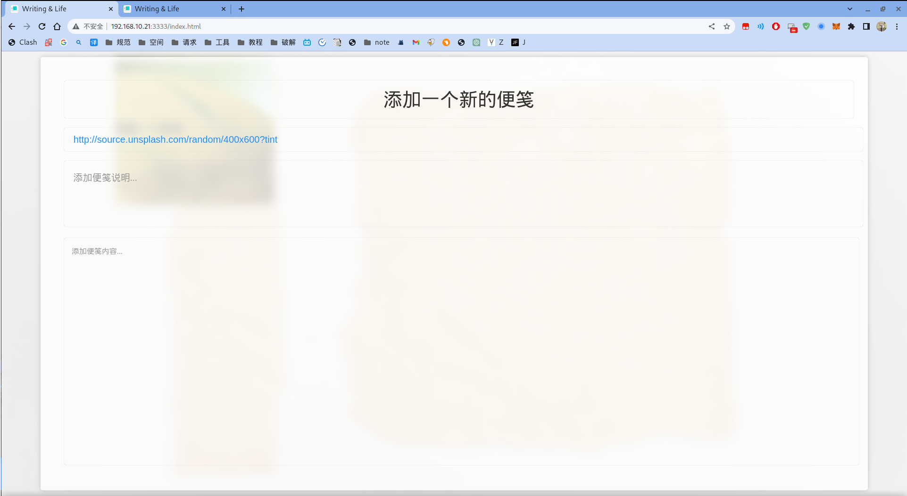
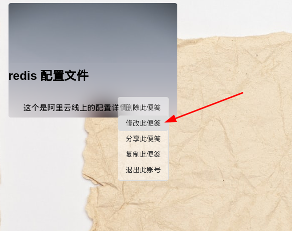
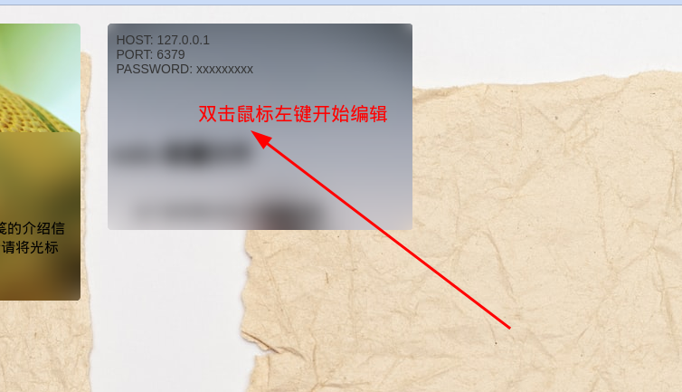
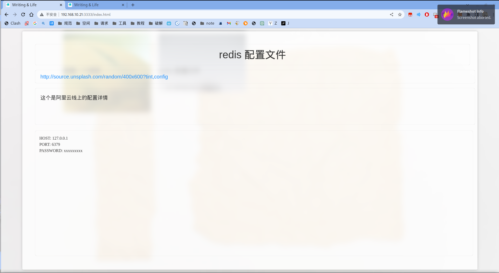
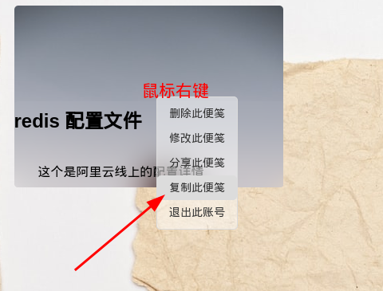
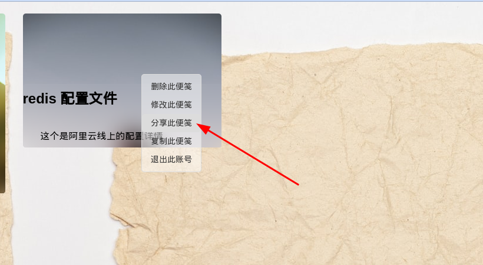
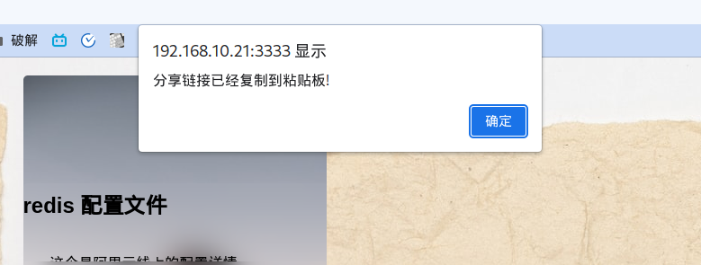
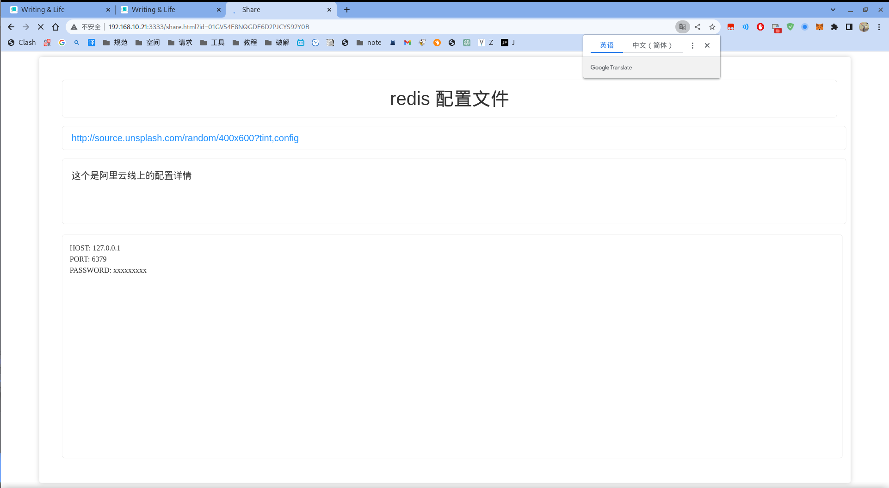
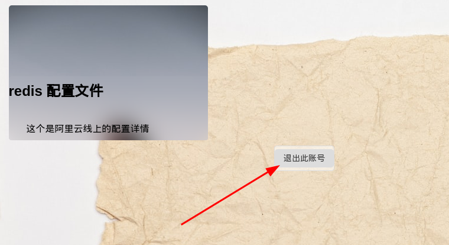

# 项目介绍
**项目用途:** 
> 本项目是一款持久化的网页便笺管理器，以轻量级为开发主要核心目的，追求简便，隐私，易用；它可以用来保存密码，配置文件，任务内容，计划列表，重要信息等[个人感觉安全等级较高，但仍然不建议将价值较高的数据存放此处]
<hr>

**项目技术:** 
> 本项目采用 nodejs & typescript 开发， 使用 sequelize 作为 ORM 框架，数据库采用轻量级数据库 sqlite(3), npm 管理项目和依赖，提供 docker 镜像构建文件

<hr>

# 食用方法
> - 注册： 
>   > 注册的时候需要使用邮箱进行注册，没有用户名的存在，密码的复杂性由用户自行决定，此处不作限制，但仍然建议用户使用强密码， 数据库不对明文进行存储，用户注册完成之后并不会启用用户的账户，需要(数据库)管理员手动对用户的账户 enabled 字段设置为 1 进行启用！

    
> - 登录： 
>   > 用户登录的时候使用邮箱加上密码进行登录，如果登录密码错误次数过多或者是账户没有被启用的情况下，用户将无法登录！


> - 首页： 
>   > 便笺的首页展示用户创建的所有的便笺，并且保留第一个便笺用于创建新便笺，用户鼠标划过便笺的时候展示便笺的内容，为方便用户及时选中拷贝，此处设计的是双击打开详情并可以进行编辑；


> - 创建便笺： 
>   > 当用户想要创建便笺的时候只需要鼠标划过第一个便笺并且按照提示双击即可，进入编辑页面之后每一个数据框可以双击解锁编辑状态或者锁定状态


> - 编辑便笺： 
>   > 进入一个便笺的编辑模式有有种方法，第一种就是鼠标划过便笺的时候双击鼠标左键进入编辑页面，第二种就是鼠标停放在需要编辑的便笺上右击鼠标选中菜单当中的编辑编辑即可进入编辑或者预览界面




> - 复制便笺： 
>   > 如果想要复制便笺的内容(不包含标题和简介)的时候可以将鼠标放置到目标便笺上右击打开菜单选择复制便笺即可，内容将会被复制到系统的粘贴板！


> - 删除便笺： 
>   > 如果希望删除便笺的话，也是将鼠标放置到目标便笺上右击鼠标打开菜单，选择删除便笺即可将此便笺删除，但是数据库仍保留数据，如果想要恢复的话只需要将数据库对应的 is_delete 修改为 0 即可


> - 分享便笺： 
>   > 如果有将便笺的内容分享给其他人的情况，也可以鼠标放到目标便笺上右击，在菜单中选择分享便笺，将会生成一个分享的链接，并自动写入系统的粘贴板，在聊天框或者沟通工具中粘贴即可； 这个文件的分享具有时效性，在项目启动的时候进行配置，如果超过这个时间的话分享链接将会失效！




> - 退出登录： 
>   > 用户退出登录将会清除掉本地存放的用户的 token， 并返回到登录页面!



## 部署方法

### 源码部署


> - git拉取仓库源码，或者下载解压源码：
> ```bash
> git clone git@github.com:Jingjiasheng/note.git
> ```

> - 修改相关配置文件
> ```bash
> vim or other editor /note/config/var.env
> 
> **sqlite数据库数据存放的全路径:** `DB_PATH`=`/data/database.sqlite`
> 
> **用户token的签名密钥:** `TOKEN_SIGN_SECRET`=`note`
> 
> **加密用户密码的加密轮次:** `BCRYPT_SALT_ROUNDS`=`12`
> 
> **用户登录的token的默认的过期时间(默认单位是h):** `TOKEN_EXPIRE`=`24`
> 
> **服务启动的默认 http 端口:** `PORT`=`3333`
> ```

> - 需要准备运行环境 npm, nodejs
> 怎么准备？，look [this](https://stackoverflow.com/questions/39981828/installing-nodejs-and-npm-on-linux "如何配置？")
> - 然后全局安装一下 ts-node: `npm install ts-node --global`
> - 是时候安装所需要的依赖了,命令: `npm i`
> - 安装完毕之后启动项目，命令: `npm run start`

### docker 部署
> - 拉取docker镜像
>   > `docker pull ghcr.io/jingjiasheng/note:1.0.0`
>   - 运行镜像(相关参数的解释见上面)
>   > ```dockerfile 
>   > docker run --name mynote 
>   > -p:外部端口:3333 
>   > -v /data/sqlite:/data/sqlite 
>   > -e PORT=3333 
>   > -e DB_PATH=/data/database.sqlie 
>   > -e TOKEN_SIGN_SECRET=note 
>   > -e BCRYPT_SALT_ROUNDS 
>   > -e TOKEN_EXPIRE=24 
>   > ghcr.io/jingjiasheng/note:1.0.0
>   > ```